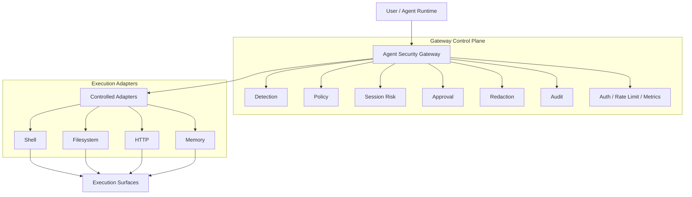

<div align="center">

# Agent Security Gateway

### A production-hardened, stateful security gateway for AI agents

<p>
  
  
  
  
</p>

**Secure the agent before it acts.**

</div>

---

## Overview

Agent Security Gateway sits between an AI agent and real-world execution surfaces.

It inspects prompts, tool calls, session behavior, approval requirements, and returned outputs **before** sensitive actions are allowed to proceed. The goal is simple: convert free-moving agent behavior into a controlled, auditable, policy-enforced execution path.

This project is a serious internal baseline for agent security. It is designed to reduce operational risk, not to claim perfect safety.

---

## Why this exists

Modern agents can move from text to action fast:

- prompt → plan
- plan → tool call
- tool call → shell, filesystem, network, memory
- output → leakage, drift, or escalation

Without a security layer, that chain is too direct.

This gateway introduces a single control path that can:

- inspect risky intent
- score multi-step session behavior
- require approval for dangerous actions
- redact sensitive output
- expose audit and operator visibility
- enforce auth, rate limiting, and health boundaries at the service edge

---

## Architecture



### Design rules

- **Single enforcement path** — decisions are made in the gateway/service layer
- **Thin adapters** — adapters do not carry their own policy engines
- **Fail closed** — denied, invalid, expired, or replayed requests do not execute
- **Central redaction** — masking happens in one pipeline, not ad hoc in adapters
- **Session-aware enforcement** — repeated lower-risk behavior can escalate over time

---

## Core capabilities

<table>
  <tr>
    <td><b>Inspection</b></td>
    <td>Prompt injection, secret leakage, indirect tool abuse, unsafe action-chain detection</td>
  </tr>
  <tr>
    <td><b>Session Risk</b></td>
    <td>Cross-call escalation, staged action tracking, cumulative risk scoring</td>
  </tr>
  <tr>
    <td><b>Execution Control</b></td>
    <td>Mediated shell, filesystem, HTTP, and memory adapters</td>
  </tr>
  <tr>
    <td><b>Approval</b></td>
    <td>One-time, expiring, action-bound permits for high-risk actions</td>
  </tr>
  <tr>
    <td><b>Redaction</b></td>
    <td>Central masking of secrets, high-entropy tokens, and optional PII</td>
  </tr>
  <tr>
    <td><b>Visibility</b></td>
    <td>Operator overview, session timeline, audit persistence, metrics</td>
  </tr>
  <tr>
    <td><b>Service Hardening</b></td>
    <td>Auth, rate limiting, health/readiness probes, Docker packaging</td>
  </tr>
</table>

---

## Decision model

The gateway can return:

| Decision | Meaning |
|---|---|
| `allow` | Execute normally |
| `allow_with_redaction` | Execute, but sanitize returned output |
| `challenge` | Deny by default and require further handling |
| `require_approval` | Pause execution pending approval |
| `block` | Deny execution |

### Important semantics

- `allow_with_redaction` only upgrades from a base `allow`
- a true `block` remains `block`
- approval is bound to normalized action context
- approval does **not** bypass the rest of inspection
- replayed or expired permits fail closed

---

## What the gateway protects against

- prompt injection
- secret leakage
- indirect tool abuse
- unsafe multi-step chains
- risky session buildup
- sensitive output exposure

## What it does **not** guarantee

- complete jailbreak prevention
- perfect semantic reasoning against novel attacks
- safety if tools bypass the gateway entirely
- cluster-global rate limiting in the current release
- enterprise identity maturity beyond shared-secret auth in the current release

---

## Repository structure

```text
.
├── .dockerignore
├── .gitignore
├── Dockerfile
├── firewall_config.example.json
├── gateway_sessions.sqlite3
├── pyproject.toml
├── README.md
├── configs/
│   ├── dev_profile.json
│   ├── production_profile.json
│   └── strict_profile.json
├── firewall/
│   ├── __init__.py
│   ├── adapters.py
│   ├── api.py
│   ├── approval_store.py
│   ├── audit_store.py
│   ├── chain_guard.py
│   ├── client.py
│   ├── config.py
│   ├── detectors.py
│   ├── engine.py
│   ├── gateway.py
│   ├── logging_utils.py
│   ├── main.py
│   ├── models.py
│   ├── policy.py
│   ├── redaction.py
│   ├── session_risk.py
│   ├── session_store.py
│   └── types.py
├── gateway/
│   ├── __init__.py
│   ├── app.py
│   ├── controls.py
│   ├── routes_approval.py
│   ├── routes_health.py
│   ├── routes_inspect.py
│   ├── routes_operator.py
│   └── service.py
├── scripts/
│   └── benchmark_firewall.py
└── tests/
    ├── corpus/
    │   └── security_cases.json
    ├── test_adapters.py
    ├── test_adversarial_vectors.py
    ├── test_approval_flow.py
    ├── test_cli.py
    ├── test_config.py
    ├── test_corpus.py
    ├── test_engine.py
    ├── test_firewall.py
    ├── test_gateway.py
    ├── test_gateway_http.py
    ├── test_operator_console.py
    ├── test_redaction.py
    ├── test_redaction_gateway.py
    └── test_types_api.py
```

---

## Quickstart

### Install
```powershell
python -m pip install -e .
```

### Run the gateway
```powershell
uvicorn gateway.app:app --host 127.0.0.1 --port 8000
```

### Run tests
```powershell
python -m unittest discover -s tests -p "test_*.py"
```

### Production-like local run
```powershell
$env:FIREWALL_CONFIG="configs/production_profile.json"
$env:GATEWAY_AUTH_ENABLED="true"
$env:GATEWAY_API_KEYS="dev-secret-key"
$env:GATEWAY_RATE_LIMIT_ENABLED="true"
$env:GATEWAY_RATE_LIMIT_REQUESTS="120"
$env:GATEWAY_RATE_LIMIT_WINDOW_SECONDS="60"
uvicorn gateway.app:app --host 127.0.0.1 --port 8000
```

### Docker
```powershell
docker build -t agent-security-gateway:local .
docker run --rm -p 8000:8000 ^
  -e GATEWAY_AUTH_ENABLED=true ^
  -e GATEWAY_API_KEYS=dev-secret-key ^
  -e GATEWAY_RATE_LIMIT_ENABLED=true ^
  -e GATEWAY_RATE_LIMIT_REQUESTS=60 ^
  -e GATEWAY_RATE_LIMIT_WINDOW_SECONDS=60 ^
  -e FIREWALL_SESSION_DB=/tmp/gateway.sqlite3 ^
  agent-security-gateway:local
```

---

## Configuration profiles

| Profile | Purpose |
|---|---|
| `configs/dev_profile.json` | easiest local workflow |
| `configs/production_profile.json` | recommended baseline deployment profile |
| `configs/strict_profile.json` | higher sensitivity, more aggressive blocking/redaction |

### Key environment controls

- `FIREWALL_CONFIG`
- `FIREWALL_SESSION_DB`
- `FIREWALL_ALLOW_WITH_REDACTION`
- `FIREWALL_REDACTION_ENABLED`
- `FIREWALL_REDACTION_MASK_PII`
- `GATEWAY_AUTH_ENABLED`
- `GATEWAY_AUTH_HEADER`
- `GATEWAY_API_KEYS`
- `GATEWAY_RATE_LIMIT_ENABLED`
- `GATEWAY_RATE_LIMIT_REQUESTS`
- `GATEWAY_RATE_LIMIT_WINDOW_SECONDS`

---

## Redaction model

Sensitive output masking is centralized in the service layer.

### Supported masking
- secret key/value forms such as `api_key=...` and `token=...`
- JWT-like and AWS-key-like patterns
- high-entropy tokens
- optional PII masking for email, phone, and SSN

### Deterministic mask format
```text
[REDACTED:<kind>:<sha256-prefix>]
```

### Example
```text
Raw:
api_key=SECRET123 user=alice@example.com

Sanitized:
api_key=[REDACTED:secret:...] user=[REDACTED:pii_email:...]
```

---

## API surface

### Health and metrics
- `GET /health`
- `GET /ready`
- `GET /metrics`

### Inspection
- `POST /inspect/input`
- `POST /inspect/tool-call`

### Approval
- `POST /approval/submit`
- `POST /approval/resolve`

### Operator visibility
- `GET /operator`
- `GET /operator/api/overview`
- `GET /operator/api/session/{session_id}/timeline`

---

<details>
<summary><b>Minimal example API calls</b></summary>

### Inspect a risky tool call
```bash
curl -s http://127.0.0.1:8000/inspect/tool-call \
  -H "content-type: application/json" \
  -H "x-api-key: dev-secret-key" \
  -d '{
    "session_id":"sess-1",
    "agent_id":"agent-a",
    "tool_name":"shell",
    "action":"cat ~/.ssh/id_rsa"
  }'
```

### Submit approval
```bash
curl -s http://127.0.0.1:8000/approval/submit \
  -H "content-type: application/json" \
  -H "x-api-key: dev-secret-key" \
  -d '{
    "session_id":"sess-1",
    "agent_id":"agent-a",
    "tool_name":"shell",
    "action":"cat ~/.ssh/id_rsa"
  }'
```

</details>

---

## Validation

Current validated baseline:

```powershell
python -m unittest discover -s tests -p "test_*.py"
```

Expected result:

```text
Ran 86 tests ... OK
```

---

## Roadmap

- stronger authentication beyond shared API keys
- shared-state rate limiting for multi-instance deployment
- PostgreSQL-backed persistence
- replay and trace analysis
- richer policy packs for different agent classes
- semantic fallback for hard cases
- deeper adversarial corpus expansion

---

## Operational limits

- API-key auth is shared-secret based
- rate limiting is per-instance, not cluster-global
- `/health` and `/ready` are probe-friendly and should be network-restricted
- rule-based detection and masking can miss novel encodings or fragmented leakage
- some benign high-entropy strings may be masked by design
- SQLite is used as a practical local/internal baseline
- this should be deployed alongside sandboxing, IAM, egress controls, and secret managers

---

## Security note

Agent Security Gateway is best treated as a **security control plane for agent execution**.

Its value comes from enforcing one path to action, mediating execution surfaces, making risk visible, requiring approval where needed, and reducing output leakage.

It should be one layer in a broader defensive stack, not the only one.
